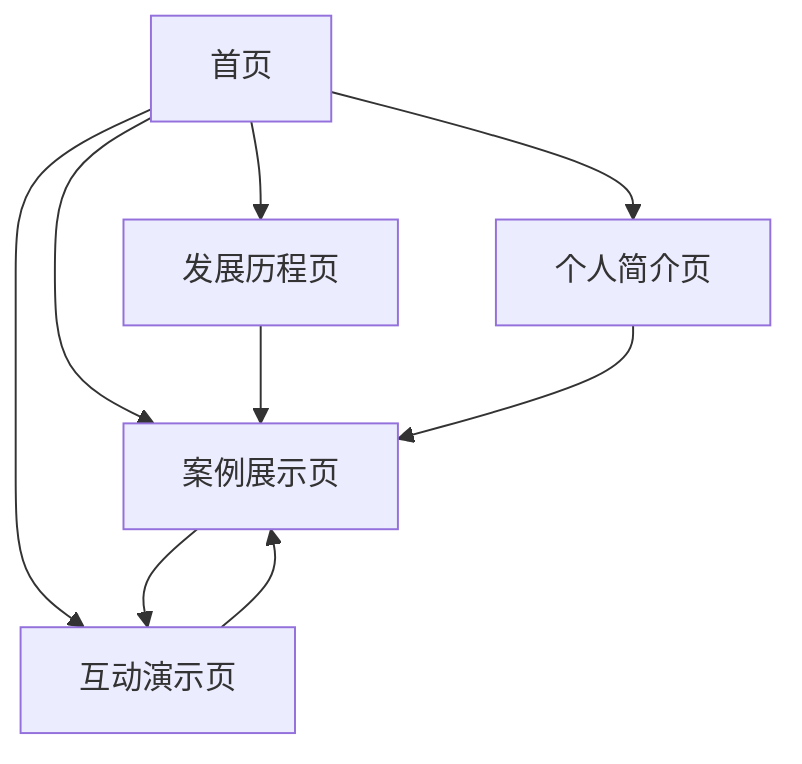

# Firebase Studio 演讲展示网站产品需求文档

## 1. 产品概述

本项目旨在创建一个专业的Firebase Studio演讲展示网站，全面展示Firebase Studio的发展历程、实战案例分析以及演讲者围巾哥萧尘的个人简介。
- 网站将作为演讲的重要支撑工具，帮助观众更好地理解Firebase Studio的技术价值和应用场景。
- 目标是打造一个现代化、交互性强的展示平台，提升演讲效果和观众体验。

## 2. 核心功能

### 2.1 用户角色

| 角色 | 访问方式 | 核心权限 |
|------|----------|----------|
| 观众用户 | 直接访问网站 | 浏览所有内容、查看案例、了解演讲者信息 |

### 2.2 功能模块

我们的Firebase Studio演讲展示网站包含以下主要页面：

1. **首页**：英雄区块、导航菜单、Firebase Studio核心亮点展示
2. **发展历程页**：时间线展示、重要里程碑、技术演进过程
3. **案例展示页**：博主案例分析、提示词展示、实战项目介绍
4. **个人简介页**：围巾哥萧尘介绍、技术背景、演讲主题关联
5. **互动演示页**：Firebase Studio功能演示、在线体验区域

### 2.3 页面详情

| 页面名称 | 模块名称 | 功能描述 |
|----------|----------|----------|
| 首页 | 英雄区块 | 展示Firebase Studio主视觉、核心价值主张、快速导航入口 |
| 首页 | 亮点展示 | 突出Firebase Studio的AI驱动开发、无代码原型、云端协作等核心特性 |
| 发展历程页 | 时间线组件 | 从2011年Envolve创立到2024年Firebase Studio发布的完整发展脉络 |
| 发展历程页 | 里程碑展示 | 关键事件详情：2014年Google收购、产品线扩展、AI功能集成 |
| 案例展示页 | 案例卡片 | 展示不同开发者使用Firebase Studio的实际项目和成果 |
| 案例展示页 | 提示词展示 | 以代码块形式展示AI原型开发的具体提示词和操作流程 |
| 个人简介页 | 个人信息 | 围巾哥萧尘的技术背景、专业经历、在Firebase领域的贡献 |
| 个人简介页 | 演讲关联 | 本次演讲的主题、目标、与Firebase Studio的技术关联性 |
| 互动演示页 | 功能演示 | Firebase Studio核心功能的可视化展示和操作流程 |
| 互动演示页 | 体验区域 | 模拟Firebase Studio界面，让观众体验AI辅助开发流程 |

## 3. 核心流程

**主要用户浏览流程：**
用户首先进入首页了解Firebase Studio概况，然后可以选择查看发展历程了解技术演进，或直接浏览案例展示学习实战应用。个人简介页帮助用户了解演讲者背景，互动演示页提供深度体验。整个流程设计为非线性浏览，用户可根据兴趣自由导航。

## 4. 用户界面设计

### 4.1 设计风格

- **主色调**：Firebase橙色(#FF6F00)作为主色，深蓝色(#1A237E)作为辅助色
- **按钮样式**：现代化圆角按钮，支持悬停动效和渐变背景
- **字体**：中文使用思源黑体，英文使用Roboto，标题18-24px，正文14-16px
- **布局风格**：卡片式设计，顶部固定导航，响应式网格布局
- **图标风格**：Material Design图标系统，配合Firebase品牌色彩

### 4.2 页面设计概览

| 页面名称 | 模块名称 | UI元素 |
|----------|----------|--------|
| 首页 | 英雄区块 | 全屏背景视频、渐变遮罩、大标题动画、CTA按钮组 |
| 首页 | 亮点展示 | 三栏卡片布局、图标+文字组合、悬停放大效果 |
| 发展历程页 | 时间线组件 | 垂直时间轴、节点动画、渐进式加载、年份标记 |
| 案例展示页 | 案例卡片 | 网格布局、图片预览、标签分类、详情弹窗 |
| 案例展示页 | 提示词展示 | 代码高亮、复制功能、语法着色、折叠展开 |
| 个人简介页 | 个人信息 | 头像圆形裁剪、技能标签云、社交链接、联系方式 |
| 互动演示页 | 功能演示 | 分步骤引导、高亮提示、操作反馈、进度指示 |

### 4.3 响应式设计

网站采用移动优先的响应式设计策略，支持桌面端演讲展示和移动端观众浏览。针对触屏设备优化交互体验，确保在不同设备上都能完美呈现演讲内容。